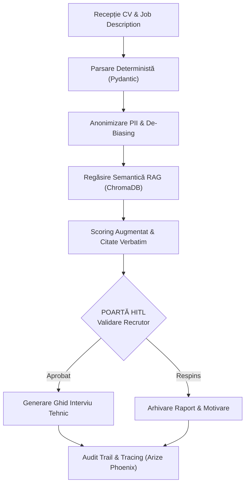
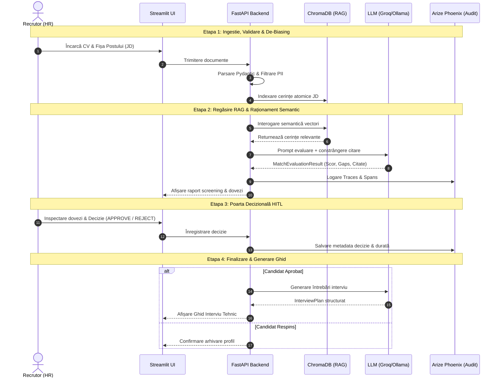
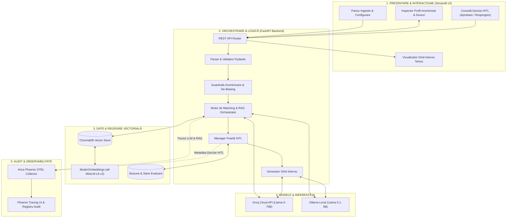
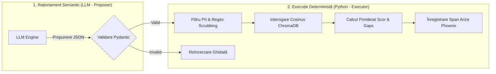

# Sistem Agentic pentru Screening Tehnic, Potrivire Semantică și Validare Umană (HITL)

[](#4-high-level-architecture--system-decomposition)
[](https://fastapi.tiangolo.com)
[](https://streamlit.io)
[](https://www.trychroma.com)
[](https://arize.com/phoenix)
[](LICENSE)

> **Documentație Tehnică de Arhitectură și Specificație de Proiect**  
> Un sistem autonom de screening și matching tehnic ghidat de inteligență artificială, bazat pe extragere deterministă (Pydantic), regăsire semantică asimetrică (RAG cu ChromaDB), de-biasing activ (eliminare PII) și poartă decizională obligatorie **Human-in-the-Loop (HITL)**, instrumentat industrial cu **Arize Phoenix**.

---

## Cuprins
1. [Problem Definition & Scope](#1-problem-definition--scope)
2. [Understanding of the Process: AS-IS vs. TO-BE](#2-understanding-of-the-process-as-is-vs-to-be)
3. [Proposed Solution & TO-BE Agentic Workflow](#3-proposed-solution--to-be-agentic-workflow)
4. [High-Level Architecture & System Decomposition](#4-high-level-architecture--system-decomposition)
5. [Data Design, RAG Strategy & RAGAS Framework](#5-data-design-rag-strategy--ragas-framework)
6. [Reasoning, Decision & Execution Concept](#6-reasoning-decision--execution-concept)
7. [KPIs & Success Criteria](#7-kpis--success-criteria)
8. [Software Product Delivery: FastAPI, Streamlit & Docker Compose](#8-software-product-delivery-fastapi-streamlit--docker-compose)
9. [Instalare, Configurare și Rulare Locală](#9-instalare-configurare-și-rulare-locală)
10. [Referințe din Industrie & Bibliografie](#10-referințe-din-industrie--bibliografie)

---

## 1. Problem Definition & Scope

### 1.1 Contextul Industrial și Deficiențele Sistemelor Convenționale
Procesele contemporane de recrutare tehnică din industria IT se confruntă cu o ineficiență structurală critică determinată de trei factori majori:

1. **Filtrare rigidă și rate mari de fals-negative**: Sistemele tradiționale de tip *Applicant Tracking System (ATS)* operează preponderent pe algoritmi rigizi de căutare booleană și potrivire exactă a cuvintelor-cheie (*keyword matching*). Candidații calificați care descriu experiențe similare folosind terminologii alternative (ex: *PostgreSQL* în loc de *baze de date relaționale SQL*, *FastAPI/Flask* în loc de *REST microservices architecture*) sunt descalificați în mod eronat.
2. **Vulnerabilitate la părtinire inconștientă (*Unconscious Bias*)**: Recrutorii umani sunt influențați involuntar de date demografice protejate și atribute non-tehnice (nume, gen, vârstă, adresă geografică, prestigiul universității absolvite), încălcând standardele de etică, incluziune și diversitate organizațională.
3. **Cost temporal și cognitiv nesustenabil**: Evaluarea manuală a fiecărui CV nestructurat, extragerea dovezilor factuale de competență, maparea lor pe cerințele fișei postului (*Job Description - JD*) și redactarea întrebărilor de interviu tehnic necesită între **20 și 40 de minute per candidat**, blocând resursele departamentelor de HR și Tech Leadership.

### 1.2 Obiectivul Proiectului
Dezvoltarea unui sistem software agentic integrat (*end-to-end*) care:
* Parsează și validează deterministic datele din CV-uri eterogene folosind scheme stricte **Pydantic**.
* Aplică un strat activ de protecție (*guardrails*) pentru curățarea datelor cu caracter personal (**PII**) și decuplarea factorilor demografici înainte de raționamentul semantic.
* Realizează indexarea și regăsirea semantică a competențelor și responsabilităților prin **Retrieval-Augmented Generation (RAG)** asistat de **ChromaDB** și embeddings dense.
* Generează un raport transparent de screening, conținând un **scor ponderat**, sinteză calitativă și **citate textuale exacte (*verbatim grounding citations*)**.
* Impune oprirea execuției într-un punct obligatoriu de control uman (**Human-in-the-Loop - HITL**) pentru confirmarea shortlist-ului.
* Sintetizează automat un **Ghid de Calibrare Tehnică pentru Interviu**, direcționat pe proiectele complexe și discrepanțele (*gaps*) identificate.

### 1.3 Delimitarea Domeniului de Aplicare (Scope & Boundaries)

| Categorie | Componente Incluse (**In-Scope**) | Componente Excluse (**Out-of-Scope**) |
| :--- | :--- | :--- |
| **Procesare Date** | Ingestia CV-urilor (JSON mock / Text) și a JD-urilor (Markdown/Text); parsare Pydantic deterministă. | Procesarea formatelor binare proprietare fără pre-conversie; integrarea cu baze de date de salarizare. |
| **Securitate & Etică** | Scrubbing PII (nume, email, telefon, universitate); validare anti-halucinație prin citate verbatim. | Decizii complet autonome de respingere (*no black-box auto-rejection*); profiling psihologic automat. |
| **Interacțiune & Output**| Panou de control interactiv în Streamlit pentru decizie HITL; generare ghid structurat de interviu. | Trimiterea nesupravegheată a email-urilor către candidați; integrare cu calendare terțe. |
| **Infrastructură & Cost**| Backend FastAPI modular; containere Docker; LLM open-source (Ollama/Groq) la cost zero de inferență. | Arhitecturi distribuite pe clustere multi-nod; baze de date vectoriale cloud plătite. |

### 1.4 Asumpții Structurale
* **Modularitatea JD-ului**: Fișele de post definesc cerințele tehnice atomar, permițând distincția între cerințe obligatorii (*must-have*) și dezirabile (*nice-to-have*).
* **Consistența Factuală**: Profilele profesionale conțin un context descriptiv minim cu privire la proiectele și responsabilitățile executive pentru a permite maparea semantică densă.

---

## 2. Understanding of the Process: AS-IS vs. TO-BE

### 2.1 Analiza Fluxului Tradițional (AS-IS)
În fluxul clasic, procesul de recrutare suferă de o lipsă acută de structură și trasabilitate:
1. **Recepție**: CV-urile sosesc ca fișiere eterogene (PDF, DOCX, email).
2. **Filtrare ATS Pasivă**: Scripturi rigide caută cuvinte-cheie exacte; lipsa sinonimelor duce la eliminarea a până la 40% din candidații competenți.
3. **Screening Manual Obositor**: Recrutorul scanează rapid documentele (în medie 6-10 secunde per scanare primară, 20-30 minute pentru analiză detaliată). Oboseala cognitivă favorizează evaluările subiective și bias-ul afectiv.
4. **Întrebări Ad-hoc**: Ghidul de interviu este conceput improvizat, fără o corelare metodică cu lacunele reale din profilul candidatului.
5. **Opacitate Totală**: Organizația nu deține un registru de audit pentru a justifica deciziile de respingere/promovare.

### 2.2 Transformarea în Paradigma Agentică (TO-BE)
Noul proces introduce o colaborare simbiotică om-AI bazată pe transparență algoritmică și verificabilitate:



### 2.3 Matrice Comparativă AS-IS vs. TO-BE

| Dimensiune de Analiză | Proces Tradițional (**AS-IS**) | Sistem Agentic Propus (**TO-BE**) | Beneficiu Direct |
| :--- | :--- | :--- | :--- |
| **Mecanism de Căutare** | Potrivire sintactică rigidă (interogări booleene). | Corelație semantică densă (*ChromaDB + Cosine Distance*). | Elimină fals-negativele cauzate de sinonime tehnice. |
| **Tratamentul Biasului** | Pasiv; evaluatorul este expus la date demografice/PII. | Activ; PII și prestigiul instituțional sunt eliminate anterior analizei. | Echitate decizională și aliniere etică. |
| **Timp Mediu per CV** | 20 – 40 minute de efort manual. | **< 2.5 minute** (analiză automată + revizuire HITL). | **Reducere de peste 90%** a timpului operațional. |
| **Fundamentare Decizie** | Estimare intuitivă, adesea nefundamentată. | Scor structurat susținut de citate textuale directe (*grounding*). | Decizii bazate pe dovezi factuale verificabile. |
| **Trasabilitate & Audit**| Inexistentă sau sumară. | Traseu complet de execuție înregistrat în **Arize Phoenix**. | Conformitate totală și transparență instituțională. |
| **Pregătire Interviu** | Întrebări generice formulate ad-hoc. | Întrebări tehnice derivate deterministic din gaps și proiecte. | Eficiență maximă în interviul tehnic inițial. |

---

## 3. Proposed Solution & TO-BE Agentic Workflow

### 3.1 Succesiunea Logică a Pipeline-ului Operațional



---

## 4. High-Level Architecture & System Decomposition

### 4.1 Arhitectura pe 5 Straturi Funcționale



### 4.2 Descrierea Subsistemelor
1. **Input Layer**: Preluarea fișierelor de intrare, validarea integrității fișierelor și normalizarea textului brut.
2. **Application & Orchestration Backend (FastAPI)**: Conține nucleul logic al aplicației, routerele REST, executorii deterministi și porțile de securitate.
3. **Data & Retrieval Layer (ChromaDB)**: Indexează asimetric cerințele atomice din fișa postului cu metadate (`requirement_id`, `is_mandatory`) și realizează căutarea semantică pe baza distanței cosinus.
4. **Model & Inference Layer**: Furnizează raționamentul cognitiv prin modele open-source accesibile la cost zero (deservire locală prin Ollama sau prin API-ul de mare viteză Groq).
5. **Observability & Audit Layer (Arize Phoenix)**: Instrumentat prin standardul **OpenInference / OpenTelemetry**, capturează toate apelurile LLM, latențele, consumul de tokeni, vectorii interogați și deciziile recrutorului.
6. **Delivery Layer (Streamlit Dashboard)**: Panoul de control web al recrutorului pentru inspectarea profilului anonimizat, a dovezilor textuale și exercitarea deciziei HITL.

---

## 5. Data Design, RAG Strategy & RAGAS Framework

### 5.1 Scheme de Date Structurate (Pydantic Models)

Toate interfețele de intrare/ieșire sunt strict garantate prin modele Pydantic:

```python
from pydantic import BaseModel, Field
from typing import List, Optional, Dict, Any

class ExperienceItem(BaseModel):
    role: str = Field(description="Titlul rolului ocupat")
    company_type: Optional[str] = Field(default=None, description="Tipul companiei (ex: FinTech, SaaS, Startup)")
    duration_months: int = Field(description="Durata cumulată a rolului în luni")
    technologies_used: List[str] = Field(description="Limbaje, framework-uri și instrumente utilizate direct")
    responsibilities_and_impact: List[str] = Field(description="Realizări măsurabile și responsabilități directe")

class ParsedCV(BaseModel):
    candidate_id: str = Field(description="Identificator unic primar")
    full_name: str = Field(description="Numele complet al candidatului")
    contact_email: str = Field(description="Adresa de e-mail")
    demographic_data: Dict[str, Any] = Field(
        default_factory=dict,
        description="Date izolate de restul procesului: vârstă, locație, gen, instituții de învățământ"
    )
    technical_skills: List[str] = Field(description="Totalitatea competențelor tehnice declarate")
    work_experience: List[ExperienceItem] = Field(description="Istoricul detaliat al experienței")
    education_level: str = Field(description="Nivelul maxim de studii (Licență, Master, Doctorat)")

class AnonymizedCandidate(BaseModel):
    candidate_hash: str = Field(description="Hash SHA-256 generat pentru trasabilitate anonimizată")
    technical_skills: List[str] = Field(description="Competențe tehnice agregate")
    work_history: List[ExperienceItem] = Field(description="Istoric profesional fără entități nominative/PII")
    education_tier: str = Field(description="Nivel academic standardizat fără denumirea instituției")

class JobRequirement(BaseModel):
    requirement_id: str = Field(description="Identificator unic al cerinței atomice")
    description: str = Field(description="Descrierea textuală atomică a cerinței")
    is_mandatory: bool = Field(default=True, description="Flag: cerință obligatorie (must-have) vs. opțională (nice-to-have)")
    domain_category: str = Field(description="Categoria tehnică (ex: Backend, Cloud/DevOps, Database)")

class MatchEvaluationResult(BaseModel):
    candidate_hash: str = Field(description="Referința profilului anonimizat")
    overall_match_score: float = Field(ge=0.0, le=100.0, description="Punctaj general calculat între 0 și 100")
    covered_requirements: List[str] = Field(description="Cerințele validate ca fiind îndeplinite")
    uncovered_gaps: List[str] = Field(description="Cerințele obligatorii sau opționale neidentificate")
    justification_summary: str = Field(description="Sinteză narativă a raționamentului de evaluare")
    grounding_citations: List[str] = Field(description="Fragmente textuale exacte extrase verbatim din CV")

class InterviewPlan(BaseModel):
    candidate_hash: str = Field(description="Identificatorul candidatului aprobat")
    tailored_technical_questions: List[str] = Field(description="Întrebări tehnice calibrate pe baza proiectelor declarate")
    gap_probing_questions: List[str] = Field(description="Întrebări de verificare pentru zonele lipsă identificate")
```

### 5.2 Strategia de Mock Data (200–500 CV-uri Sintetice)
Pentru o calibrare statistică riguroasă, corpusul de test este structurat pe 5 arhetipuri:

| Tipologie Profil | Procentaj din Set | Caracteristici Tehnice Reprezentative | Rol în Validarea Sistemului |
| :--- | :---: | :--- | :--- |
| **1. Candidat Ideal** | 20% | Acoperire 100% *must-have*, >80% *nice-to-have*, experiență solidă direct aliniată. | Calibrarea pragului superior de scoring și a ratei de aprobare HITL. |
| **2. Profil Echivalent Semantic** | 25% | Utilizează tehnologii echivalente (ex: GCP + Terraform în loc de AWS + CloudFormation; FastAPI în loc de Flask). | Testarea generalizării semantice prin embeddings ChromaDB. |
| **3. Profil Sub-Calificat** | 30% | Lipsesc tehnologii critice obligatorii, experiență temporală insuficientă. | Verificarea detecției corecte a discrepanțelor (*uncovered_gaps*) și a respingerii justificate. |
| **4. Profil cu Risc de Bias** | 15% | Conține PII explicit, locație geografică, vârstă, universități de prestigiu. | Auditarea eficienței filtrului de anonimizare și de-biasing. |
| **5. Profil cu Zgomot / Atipic** | 10% | Structură narativă neconvențională, formatări atipice de text. | Testarea rezilienței mecanismului de extragere deterministă Pydantic. |

### 5.3 Strategia RAG Asimetric în ChromaDB
* **Indexare**: Fișa postului este descompusă în elemente atomice $R_i$ de tip `JobRequirement`. Fiecare cerință este transformată într-un vector dens $v(R_i)$ folosind modelul de embedding `all-MiniLM-L6-v2` și stocată cu metadatele aferente (`requirement_id`, `is_mandatory`).
* **Interogare**: Fiecare experiență $E_j$ din `AnonymizedCandidate` este vectorizată și interogată împotriva colecției ChromaDB folosind distanța cosinus:

$$
	ext{Similarity}(E_j, R_i) = rac{v(E_j) \cdot v(R_i)}{\|v(E_j)\| \|v(R_i)\|}
$$

* **Grounding Constrâns**: Cele mai relevante potriviri sunt transmise LLM-ului cu o constrângere strictă de citare (*verbatim citation rule*): orice cerință validată trebuie însoțită de fragmentul textual exact extras din CV.

### 5.4 Cadrul Formal de Evaluare RAG prin Ragas
Pentru auditarea automată a componentei RAG, se utilizează metricele din biblioteca **Ragas**:
1. **Faithfulness (Fidelitate)**:

$$
	ext{Faithfulness} = rac{|	ext{Afirmații susținute direct de contextul CV}|}{|	ext{Total afirmații generate în evaluare}|}
$$

2. **Answer Relevance**: Evaluează dacă raportul de sinteză și întrebările răspund strict cerințelor postului.
3. **Context Precision**: Măsoară dacă cerințele cele mai relevante sunt returnate pe primele poziții în ChromaDB.
4. **Context Recall**: Verifică dacă toate dovezile necesare pentru validarea cerințelor obligatorii au fost extrase de retriever.

---

## 6. Reasoning, Decision & Execution Concept

### 6.1 Separarea Strictă: Reasoning (LLM) vs. Execuție Deterministă
Pentru a elimina riscurile inerente asociate halucinațiilor și nedeterminismului LLM-urilor în producție:
* **LLM-ul acționează exclusiv ca Proposer**: Generează propuneri de scoring și extrageri structurate JSON validate static prin Pydantic.
* **Executori Determiniști (Python Pure Tools)**: Realizează operațiunile critice — salvarea stărilor, calculul matematic al scorului ponderat, interogările în baza de date vectorială, curățarea regex a datelor PII și trimiterea span-urilor de telemetrie.



### 6.2 Stratul de Gardare Anti-Bias & Protecția Datelor
1. **Scrubbing Determinist**: Extracție și eliminare prin regex și NER a adreselor de email, numerelor de telefon, link-urilor sociale și numelor proprii.
2. **Standardizare Instituțională**: Denumirile explicite ale universităților sunt cartografiate pe trepte abstracte (*ex: Diplomă de Licență în Științe Exacte*), prevenind bias-ul de prestigiu.
3. **Izolarea Datelor Demografice**: Vârsta, genul și localitatea sunt izolate în dicționarul `demographic_data` și excluse din prompt-ul de evaluare.

### 6.3 Matricea Pragurilor Decizionale și Poarta HITL

| Categorie Scor & Condiții Tehnice | Recomandare Algoritmică | Vizualizare în UI Dashboard | Decizie Operator Uman (HITL) | Acțiune Post-Decizie |
| :--- | :--- | :--- | :--- | :--- |
| **Scor $\ge 70.0\%$** și **0 gaps must-have** | **Recomandare Favorabilă** | Shortlist propus; afișare dovezi verbatim și sinteză calitativă. | `APPROVE` sau `REJECT` | Aprobarea declanșează automat generarea ghidului de interviu. |
| **$50.0\% \le 	ext{Scor} < 70.0\%$** sau **max. 1 gap must-have** | **Zonă de Atenție (Borderline)** | Flag galben; evidențiere discrepanțe tehnice și competențe lipsă. | `APPROVE` (cu justificare) sau `REJECT` | Permite recrutorului să valideze competențe compensatorii. |
| **Scor $< 50.0\%$** sau **$\ge 2$ gaps must-have** | **Recomandare Negativă** | Profil clasificat ca sub-calificat; motivare automată. | `APPROVE` (override) sau `REJECT` | Respingerea arhivează raportul; datele sunt stocate pentru audit. |

---

## 7. KPIs & Success Criteria

Pentru evaluarea cantitativă a performanței soluției în raport cu procesul tradițional, sunt monitorizate 5 metrici cheie:

### 7.1 Rata de Acord Uman-AI (Recruiter Alignment Rate - RAR)
Măsoară procentul de candidaturi recomandate de sistem care sunt validate afirmativ de recrutor în nodul HITL:

$$
	ext{RAR} = \left( rac{N_{	ext{aprobate}}}{N_{	ext{propuse}}} 
ight) 	imes 100
$$

* **Criteriu de succes**: $\mathbf{RAR \ge 80\%}$, indicând calibrarea raționamentului semantic pe standardele reale ale companiei.

### 7.2 Scorul de Fidelitate a Citărilor (Citation Verification Score - CVS)
Măsoară integritatea dovezilor textuale prin verificarea existenței exacte a fiecărui fragment din `grounding_citations` în textul sursă al CV-ului:

$$
	ext{CVS} = \left( rac{N_{	ext{citari valide}}}{N_{	ext{total citari}}} 
ight) 	imes 100
$$

* **Criteriu de succes**: $\mathbf{CVS = 100\%}$, garantând eliminarea completă a halucinațiilor factuale.

### 7.3 Rata de Intervenție Umană Extinsă (Human Intervention Rate - HIR)
Măsoară procentul de cazuri ambigue (*borderline*) care necesită analiză manuală extinsă:

$$
	ext{HIR} = \left( rac{N_{	ext{cazuri borderline}}}{N_{	ext{total candidaturi}}} 
ight) 	imes 100
$$

* **Criteriu de succes**: $\mathbf{HIR \le 20\%}$, demonstrând decizii algoritmice cu certitudine ridicată pentru majoritatea profilurilor.

### 7.4 Reducerea Timpului de Îndeplinire (Time-to-Fulfillment Reduction - TFR)

$$
	ext{TFR} = \left( rac{T_{	ext{manual}} - T_{	ext{agentic}}}{T_{	ext{manual}}} 
ight) 	imes 100
$$

* **Criteriu de succes**: $\mathbf{TFR \ge 75\%}$, reducând timpul mediu de la ~30 min la sub 2.5 min per candidat.

### 7.5 Timpul Mediu de Rezoluție Simulat (Mean Time to Resolution - MTTR)
Evaluează durata totală necesară pentru parcurgerea unui set de 100 de CV-uri asociate unei poziții deschise:
* **Baseline Manual**: 50 ore om.
* **Sistem Agentic + HITL**: sub 4 ore om (**reducere operațională de peste 90%**).

---

## 8. Software Product Delivery: FastAPI, Streamlit & Docker Compose

### 8.1 Specificația API-ului REST Backend (FastAPI)

| Metodă HTTP | Endpoint | Descriere Funcțională |
| :--- | :--- | :--- |
| `POST` | `/api/v1/cv/ingest` | Recepționează CV-ul brut, aplică parsarea Pydantic și de-identificarea PII, returnând `candidate_hash`. |
| `POST` | `/api/v1/jd/index` | Fragmentează și vectorizează cerințele atomice din fișa postului în ChromaDB. |
| `POST` | `/api/v1/evaluate/match` | Rulează RAG-ul și motorul de raționament, returnând obiectul structurat `MatchEvaluationResult`. |
| `POST` | `/api/v1/hitl/submit-decision` | Recepționează decizia recrutorului (`APPROVE`/`REJECT`) și înregistrează span-ul de audit în Arize Phoenix. |
| `POST` | `/api/v1/interview/generate` | Punct final condiționat de aprobarea HITL, generează structura `InterviewPlan`. |
| `GET` | `/health` | Healthcheck pentru statusul ChromaDB, Ollama/Groq și Arize Phoenix. |

### 8.2 Interfața Utilizator (Streamlit Dashboard)
* **Panou de Configurare**: Selectare model de inferență (Groq API vs. Ollama local) și încărcare fișiere de intrare.
* **Vizualizator Profil Anonimizat**: Inspecția competențelor și experienței fără date PII sau demografice.
* **Matrice de Evaluare Semantică**: Afișare scor procentual, evidențiere cerințe acoperite (verde) și gaps (roșu).
* **Secțiune de Grounding**: Afișarea citatelor textuale exacte extrase din CV.
* **Consolă HITL**: Butoane `[APPROVE]` / `[REJECT]` cu înregistrarea automată a timpului de revizuire și notelor de audit.
* **Ghid de Interviu Tehnic**: Generat dinamic post-aprobare, conținând întrebări specifice de calibrare pe proiecte și tehnologii.

### 8.3 Topologia Docker Compose (`docker-compose.yml`)

```yaml
version: '3.8'

services:
  phoenix:
    image: arizephoenix/phoenix:latest
    container_name: phoenix_observability
    ports:
      - "6006:6006"
    environment:
      - PHOENIX_PORT=6006
      - PHOENIX_SQL_DATABASE_URL=sqlite:////tmp/phoenix.db
    volumes:
      - phoenix_data:/tmp

  fastapi_backend:
    build:
      context: .
      dockerfile: Dockerfile.backend
    container_name: screening_backend
    ports:
      - "8000:8000"
    environment:
      - PHOENIX_COLLECTOR_ENDPOINT=http://phoenix:6006/v1/traces
      - GROQ_API_KEY=${GROQ_API_KEY}
      - OLLAMA_BASE_URL=http://host.docker.internal:11434
    depends_on:
      - phoenix
    volumes:
      - ./chroma_db:/app/chroma_db

  streamlit_ui:
    build:
      context: .
      dockerfile: Dockerfile.frontend
    container_name: screening_dashboard
    ports:
      - "8501:8501"
    environment:
      - BACKEND_API_URL=http://fastapi_backend:8000
    depends_on:
      - fastapi_backend

volumes:
  phoenix_data:
```

---

## 9. Instalare, Configurare și Rulare Locală

### 9.1 Cerințe Preliminare
* Python 3.10+
* Docker & Docker Compose
* [Ollama](https://ollama.ai) instalat local (cu modelul `llama3.1:8b`) **SAU** un API Key gratuit de la [Groq Cloud](https://console.groq.com).

### 9.2 Rulare cu Docker Compose (Recomandat)

1. **Clonare repository**:
   ```bash
   git clone https://github.com/MorariuMark/agentic-recruitment-screening.git
   cd agentic-recruitment-screening
   ```

2. **Configurare variabile de mediu**:
   ```bash
   cp .env.example .env
   # Completați GROQ_API_KEY în .env dacă doriți inferență prin Groq Cloud
   ```

3. **Pornire servicii**:
   ```bash
   docker-compose up --build
   ```

4. **Accesare aplicații**:
   * **Streamlit UI**: [http://localhost:8501](http://localhost:8501)
   * **FastAPI Docs (Swagger)**: [http://localhost:8000/docs](http://localhost:8000/docs)
   * **Arize Phoenix Tracing**: [http://localhost:6006](http://localhost:6006)

---

## 10. Referințe din Industrie & Bibliografie

1. **Arize AI / OpenInference**: *OpenTelemetry Instrumentation for LLM Applications*, [GitHub Repository](https://github.com/Arize-ai/openinference).
2. **Arize Phoenix Documentation**: *LLM Tracing and Observability*, [Arize Docs](https://arize.com/docs/phoenix).
3. **Machine Learning Mastery**: *LLM Observability Tools for Reliable AI Applications*, [MLMastery](https://machinelearningmastery.com/llm-observability-tools-for-reliable-ai-applications/).
4. **Ragas Framework**: *Evaluation framework for Retrieval Augmented Generation*, [Ragas Documentation](https://docs.ragas.io).
5. **ChromaDB**: *The AI-native open-source embedding database*, [Chroma Docs](https://docs.trychroma.com).
6. **FastAPI & Pydantic v2**: *High-performance asynchronous APIs in Python*, [FastAPI](https://fastapi.tiangolo.com).

---
*Proiect realizat pentru disciplina Sisteme Agentice & AI Screening.*
