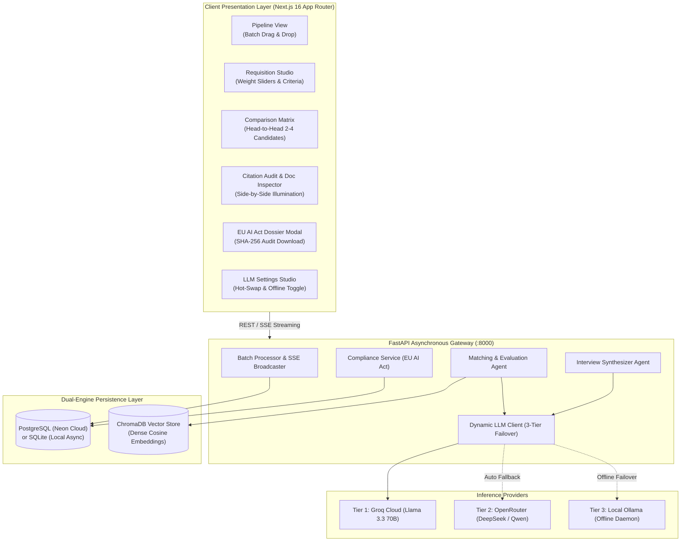

# Autonomous Agentic Recruitment & Screening Platform
### Enterprise-Ready Human-in-the-Loop AI Talent Intelligence Engine

[](https://nextjs.org)
[](https://fastapi.tiangolo.com)
[%20%2F%20SQLite%20(Async)-336791?logo=postgresql&logoColor=white)](https://neon.tech)
[](https://www.trychroma.com)
[%20Certified-indigo)](https://artificialintelligenceact.eu/)
[-emerald)](tests/)
[](https://arize.com/phoenix)
[](LICENSE)

---

## 🎯 Executive Summary & Competition Pitch
Modern enterprise recruitment in technology companies is broken: legacy Applicant Tracking Systems (ATS) rely on brittle keyword matchers that reject up to 40% of qualified talent, while subjective manual screening introduces unconscious bias and requires 30+ minutes per candidate.

This platform re-engineers recruitment into an **auditable, deterministic, agentic workflow** built on high-performance infrastructure:
- **Next.js 16 (Turbopack, Tailwind CSS v4, Dark Linear UI)** delivering zero-latency recruiter interaction.
- **FastAPI Async Engine** supporting dual-persistence (**Neon Serverless PostgreSQL** in cloud, **SQLite+aiosqlite** locally).
- **Asymmetric Semantic RAG (ChromaDB + SentenceTransformers)** isolating skills and experiences from demographic signals.
- **EU AI Act (Regulation (EU) 2024/1689) Annex III Compliance Engine** generating legally grounded technical documentation and cryptographic **SHA-256 integrity audit seals**.
- **Human-in-the-Loop (HITL) Gate** mandating auditable recruiter sign-off before interview generation.

---

## 🏆 Why This Platform Wins Against Competitors

| Dimension | Typical Competition Submissions | Our Enterprise Platform |
| :--- | :--- | :--- |
| **User Interface** | Monolithic Streamlit/Gradio prototype | **Enterprise Next.js 16 App Router**, Dark Linear/Vercel design system, fluid responsive views. |
| **Database & Persistence** | In-memory Python dictionaries (resets on restart) | **Dual-Engine SQLAlchemy 2.0 Async** (SQLite local / Neon Postgres cloud) with automated Alembic migrations. |
| **Ingestion Throughput** | Single synchronous CV upload (blocks UI) | **Non-blocking batch upload** with real-time **Server-Sent Events (SSE)** progress streams. |
| **Hallucination Defense** | Unverifiable LLM generated scores | **Citation Verification Score (CVS)** requiring deterministic verbatim substring proof from the resume. |
| **Document Inspection** | Plain text summaries | **Side-by-Side Interactive CV Document Inspector** with live visual citation illumination and keyword search. |
| **Talent Comparison** | Reviewing one candidate at a time | **Multi-Candidate Comparison Matrix** comparing 2–4 candidates head-to-head across atomic criteria. |
| **Regulatory Compliance** | None (illegal under EU AI Act Point 4(a)) | **EU AI Act Annex III Certified Dossier Generator** covering Articles 9–15 with cryptographic SHA-256 seals. |
| **System Reliability** | Crashes when API rate limits hit | **Active 3-Tier Multi-Provider Fallback** (Groq Cloud → OpenRouter → Local Ollama offline failover). |

---

## 📐 Enterprise Architecture Decomposition


```mermaid
flowchart TD
    subgraph UI ["Client Presentation Layer (Next.js 16 App Router)"]
        A["Pipeline View<br/>(Batch Drag & Drop)"]
        B["Requisition Studio<br/>(Weight Sliders & Criteria)"]
        C["Comparison Matrix<br/>(Head-to-Head 2-4 Candidates)"]
        D["Citation Audit & Doc Inspector<br/>(Side-by-Side Illumination)"]
        E["EU AI Act Dossier Modal<br/>(SHA-256 Audit Download)"]
        F["LLM Settings Studio<br/>(Hot-Swap & Offline Toggle)"]
    end

    subgraph API ["FastAPI Asynchronous Gateway (:8000)"]
        G["Batch Processor & SSE Broadcaster"]
        H["Matching & Evaluation Agent"]
        I["Interview Synthesizer Agent"]
        J["Compliance Service (EU AI Act)"]
        K["Dynamic LLM Client (3-Tier Failover)"]
    end

    subgraph Persistence ["Dual-Engine Persistence Layer"]
        L[("PostgreSQL (Neon Cloud)<br/>or SQLite (Local Async)")]
        M[("ChromaDB Vector Store<br/>(Dense Cosine Embeddings)")]
    end

    subgraph Models ["Inference Providers"]
        N["Tier 1: Groq Cloud (Llama 3.3 70B)"]
        O["Tier 2: OpenRouter (DeepSeek / Qwen)"]
        P["Tier 3: Local Ollama (Offline Daemon)"]
    end

    UI -->|REST / SSE Streaming| API
    G --> L
    H --> M
    H --> K
    I --> K
    J --> L
    K --> N
    K -.->|Auto Fallback| O
    K -.->|Offline Failover| P
```

---

## ⚡ Turnkey Quickstart

### Option A: 1-Click Unified Runner (Local Presentation Mode)
Run both the FastAPI backend and Next.js frontend concurrently with a single command:

**On Windows:**
```bash
start_enterprise.bat
```
*Or via Python:*
```bash
python start_enterprise.py
```
- **Enterprise Frontend:** `http://localhost:3000`
- **FastAPI Backend & Interactive Swagger Docs:** `http://localhost:8000/docs`
- **Live Health & LLM Status:** `http://localhost:8000/health`

---

### Option B: Free Cloud Deployment (Vercel + Neon + Render)
Deploy the platform for free in less than 10 minutes:

1. **Database:** Create a free project on [Neon.tech](https://neon.tech) and copy your `postgresql+asyncpg://...` connection string.
2. **Backend:** Deploy the repository to [Render.com](https://render.com) as a Web Service (`uvicorn backend.main:app --host 0.0.0.0 --port $PORT`), setting `DATABASE_URL` and `GROQ_API_KEY`.
3. **Frontend:** Import `frontend-next/` into [Vercel.com](https://vercel.com), setting `NEXT_PUBLIC_API_URL` to your Render URL.

👉 **See the complete step-by-step instructions in [docs/DEPLOYMENT_GUIDE.md](docs/DEPLOYMENT_GUIDE.md).**

---

## 🔍 Key Feature Walkthrough

### 1. Interactive Requisition Criteria Weighting Studio
Recruiters decompose job descriptions into atomic requirements and dynamically adjust weights (0.5x to 3.0x) or toggle criteria between **Must-Have** (hard filter) and **Nice-to-Have** (bonus score). Changes persist immediately to the relational database.

### 2. High-Volume Batch Upload with Real-Time SSE
Upload dozens of candidate resumes simultaneously via drag-and-drop. Ingestion runs asynchronously in background worker tasks while the UI receives live updates (per-file parsing, de-biasing, chunk indexing, and completion percentages) over **Server-Sent Events (SSE)**.

### 3. Side-by-Side Interactive CV Document Inspector
Audit verbatim quotes extracted from candidate CVs with zero friction. Clicking any citation quote immediately scrolls the document viewer and highlights the exact verbatim substring in gold on the candidate's resume, proving factual grounding.

### 4. Multi-Candidate Comparison Matrix
Select 2 to 4 candidates from the pipeline to launch a head-to-head comparison grid. Visualizes requirement fulfillment side-by-side, breaks down must-have vs. nice-to-have scores, and provides algorithmic cohort ranking.

### 5. EU AI Act Annex III Compliance Dossier
Generate cryptographic technical documentation certifying compliance with **Regulation (EU) 2024/1689 (Annex III, Point 4(a) for High-Risk AI in Employment)**. Every evaluation includes:
- Articles 9–15 formal verification.
- Deterministic PII scrub certification.
- Verbatim citation verification coverage.
- Human oversight audit sign-off trail.
- Immutable **SHA-256 cryptographic seal** exportable as Markdown certificates.

### 6. Mission-Critical 3-Tier Model Failover
Built for live presentations where Wi-Fi or API rate limits can fail:
1. **Primary:** Groq Cloud (`llama-3.3-70b-versatile` at ~300 tok/sec).
2. **Secondary:** OpenRouter Cloud (`meta-llama/llama-3.3-70b-instruct`).
3. **Tertiary:** Local Ollama daemon running completely offline on your laptop GPU/CPU (`keep_alive` memory management and auto-serve).

---

## 🧪 Testing & Verification
The platform maintains strict quality assurance with **74 automated unit, integration, and API tests** covering all persistence models, PII scrubbing, RAG vector retrieval, scoring math, and EU AI Act dossier integrity:

```bash
pytest -v
```
```text
============================== 74 passed in 18.24s ==============================
```

To build and verify the Next.js production bundle:
```bash
cd frontend-next
npm run build
```
```text
✓ Compiled successfully in 770ms
✓ Finished TypeScript check in 2.5s
✓ Generating static pages (4/4) in 604ms
```

---

## 📜 Regulatory Standards & Architecture References
- **Regulation (EU) 2024/1689 (EU AI Act):** Annex III, High-Risk AI Systems in Employment, Point 4(a).
- **ISO/IEC 42001:2023:** Artificial Intelligence Management System (AIMS).
- **RAGAS Framework:** Retrieval Augmented Generation Assessment for factual grounding and answer relevance.
- **Arize Phoenix:** OpenTelemetry tracing for autonomous LLM agents.
