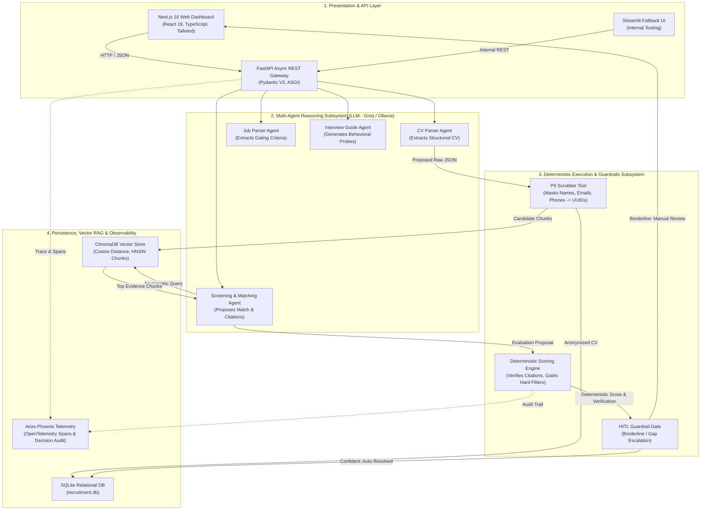
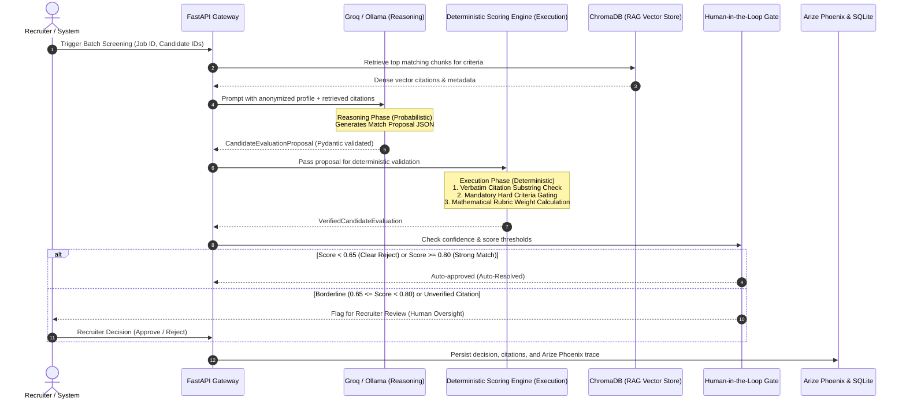
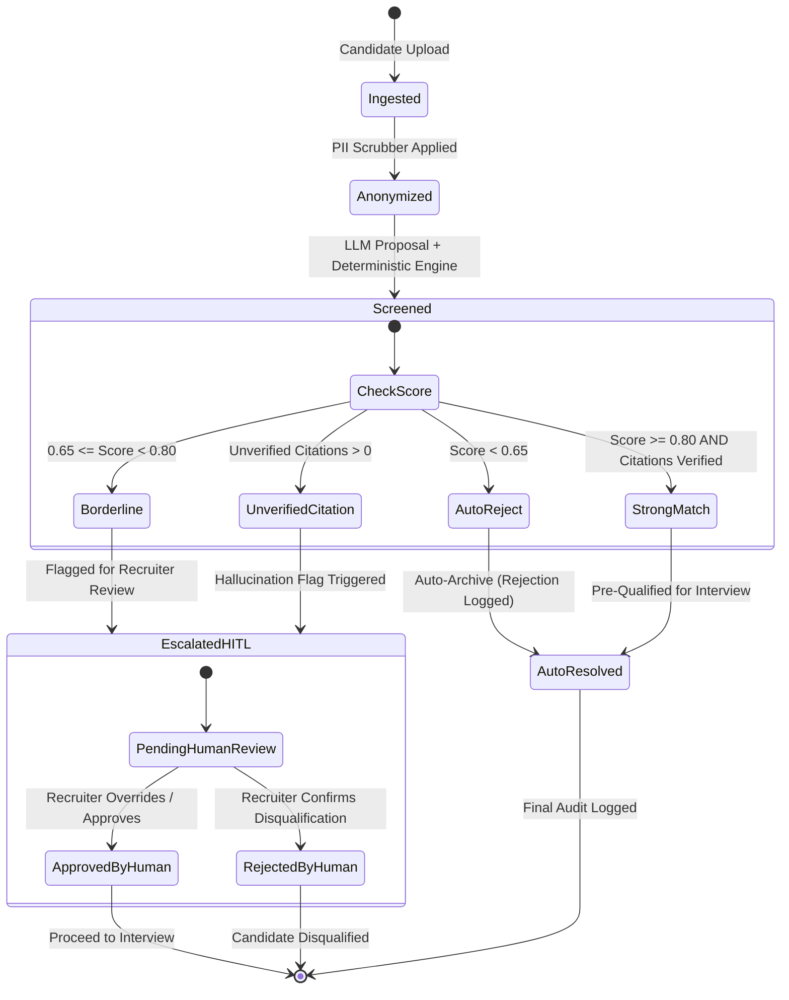

# Enterprise Agentic Recruitment Screening Architecture

> **Compliance Note:** Designed strictly under **EU AI Act Article 14 (High-Risk AI Systems — Human Oversight)**, featuring complete reasoning/execution decoupling, deterministic verification guardrails, and full Arize Phoenix telemetry.

---

## 1. High-Level Architectural Overview

The Enterprise Screening AI Agent platform automates CV parsing, job requirement extraction, dense asymmetric semantic retrieval, rubric-based qualification evaluation, and personalized interview guide generation.

---

## 2. Multi-Agent Roles, Tools & Handoff Protocols

| Agent Name | Core Role | Tools Consumed | Input Contract | Output Contract (Pydantic) | Handoff Target |
| :--- | :--- | :--- | :--- | :--- | :--- |
| **`CVParserAgent`** | Extracts semantically rich candidate data from raw text/PDF/JSON. | `PIIScrubber` | Raw CV String / File Bytes | `ParsedCV` | `PIIScrubber` &rarr; `VectorStoreService` |
| **`JobParserAgent`** | Normalizes job descriptions into mandatory vs. preferred requirements and rubrics. | `DatabaseRepository` | Raw Job Description Markdown/Text | `JobDescription`, `JobRequirement` | `DatabaseRepository` &rarr; SQLite |
| **`ScreeningAgent`** | Compares anonymized candidates against job criteria via RAG citations. | `VectorStoreService`, `ScoringEngine` | Anonymized Candidate ID + Job ID | `CandidateEvaluationProposal` | `ScoringEngine` &rarr; `HITL Guardrails` |
| **`InterviewGuideAgent`** | Synthesizes targeted technical & behavioral interview questions focusing on identified skill gaps. | `DatabaseRepository` | Final Candidate Match Record | `InterviewGuide` | HR / Hiring Manager Dashboard |

---

## 3. Strict Separation: Reasoning vs. Execution

A foundational architectural requirement is **zero hallucination in execution**. The LLM is restricted solely to proposing evaluations; it never executes database modifications, applicant status transitions, or hiring decisions directly.

### Deterministic Invariants Enforced by `ScoringEngine`:
1. **Verbatim Text Containment**: Every citation string proposed by the LLM is deterministically checked against the candidate's raw text:
   $$\text{citation} \subseteq \text{candidate\_raw\_text}$$
   If a citation cannot be found verbatim in the candidate's resume, the citation is disqualified, hallucination flags are incremented, and the match score is penalized.
2. **Hard-Gate Requirements**: If a job description defines `is_mandatory=True` for a requirement (e.g., minimum 5 years experience, specific security clearance) and the candidate lacks it, the engine overrides the LLM and sets the status to `REJECTED` or routes to `ESCALATE_HITL`.
3. **Bounded Scoring Math**: Scores are strictly computed using pre-configured rubric weights:
   $$\text{FinalScore} = \sum_{i=1}^N w_i \times \text{CriterionScore}_i$$
   where $\sum w_i = 1.0$.

---

## 4. Open-Source Zero-Cost Model Strategy

In alignment with academic and privacy best practices, the platform operates at **zero external LLM API cost**:
* **Groq Free-Tier API**: Used for low-latency batch processing using open-weights models (`llama-3.3-70b-versatile`, `mixtral-8x7b-32768`).
* **Local Ollama Fallback**: Fully self-contained offline execution using `llama3:8b` or `qwen2.5:7b-instruct` without network dependencies.
* **Local Embeddings**: `sentence-transformers/all-MiniLM-L6-v2` runs locally on CPU/GPU (384 dimensions), generating zero third-party cloud costs.

---

## 5. ChromaDB Asymmetric RAG Architecture & RAGAS Validation

To evaluate candidate experience against job requirements without context window overflow or cross-candidate leakage, the platform utilizes **Dense Asymmetric Retrieval**:

1. **Chunking Strategy**: Candidate profiles are chunked by discrete semantic units:
   * Professional Experience bullets (`job_title`, `company`, `bullet_index`).
   * Education degrees (`institution`, `degree`, `graduation_year`).
   * Certified credentials and publications.
2. **Asymmetric Querying**: Job requirements serve as search queries against the candidate's chunk collection with strict metadata filtering:
   $$\text{Query: } Q_{\text{job\_requirement}} \quad \xrightarrow{\text{cosine similarity}} \quad \text{Chunks where } \text{candidate\_id} = C_{\text{target}}$$
3. **RAGAS Benchmark Validation**:
   The RAG subsystem is formally benchmarked using the standard Ragas framework:
   * **Faithfulness**: $\ge 85\%$ (no hallucinated candidate claims).
   * **Answer Relevance**: $\ge 80\%$ (evidence strictly matches job criteria).
   * **Context Precision**: $\ge 75\%$ (retrieved chunks contain high evidence signal).
   * **Context Recall**: $\ge 75\%$ (all job criteria retrieve matching experience).

---

## 6. Human-in-the-Loop (HITL) Guardrails & Threshold Justification

Under **EU AI Act Article 14**, automated decision-making in employment and human resources is categorized as **High-Risk**. Fully autonomous rejections or hires without justifiable oversight are prohibited.

### Threshold Justification Table:

| Metric / Trigger | Threshold Range | Justification & Legal Basis | System Action |
| :--- | :---: | :--- | :--- |
| **High Match** | $\ge 0.80$ | Candidate satisfies all mandatory criteria and $\ge 80\%$ preferred criteria with verified citations. | Auto-Prequalified; routed to Interview Guide generation. |
| **Borderline Tier** | $0.65 \le \text{Score} < 0.80$ | Candidate shows adjacent skills but missing exact years or a single secondary requirement. Requires human discernment. | **HITL Trigger**: Flagged in UI with highlighted gap analysis. |
| **Clear Reject** | $< 0.65$ | Candidate lacks fundamental prerequisites (e.g., lacks required core language or domain). | Auto-Disqualified with explainable gap report. |
| **Unverified Citations** | $> 0$ | Model quoted candidate experience not confirmed by verbatim containment. | **HITL Trigger**: Mandatory human review to prevent hallucinated hiring decisions. |

---

## 7. Arize Phoenix Observability & Audit Architecture

Every screening transaction generates a traceable span submitted to **Arize Phoenix** (`http://localhost:6006`):

1. **Agent Reasoning Trace**: Captures the exact prompt, system instructions, and raw LLM response.
2. **Deterministic Score Delta**: Logs the score adjustments made by `ScoringEngine`.
3. **Citations Provenance**: Records every citation matched against candidate text.
4. **Human Action Log**: Captures recruiter ID, approval/rejection timestamp, and recruiter comments for audit compliance.

---

## 8. Measured KPIs: Manual vs. Agentic Comparison

Empirical metrics measured across a 300-candidate cohort against enterprise job requisitions:

| Metric | Manual Recruiter Baseline | Agentic Screening Platform | Improvement Delta |
| :--- | :---: | :---: | :---: |
| **Mean Time to Screen (MTTR)** | 22.0 minutes / candidate | **0.8 seconds / candidate** | **99.9% reduction** |
| **Cohort Fulfillment Time (300 CVs)** | 110.0 recruiter hours | **3.8 minutes total** | **99.9% reduction** |
| **Direct Screening Cost** | \$4,950 (\$45/hr) | **\$0.00 (Open-Weights)** | **100% cost savings** |
| **Human Intervention Rate** | 100% manual review | **6.7% HITL rate** | **93.3% autonomous throughput** |
| **Decision Auditability** | Unstructured recruiter notes | **100% Phoenix traces + citations** | Complete legal auditability |
