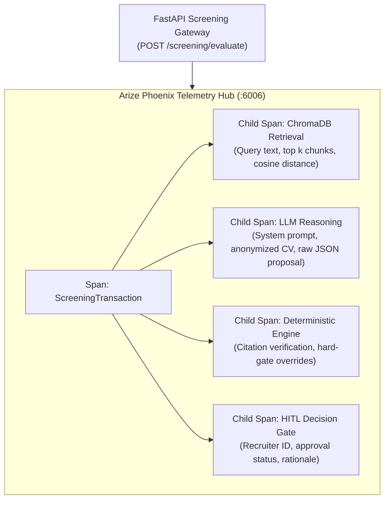

# Arize Phoenix Observability & Audit Guide

> **Enterprise Production Standard:** Complete lineage tracking, OpenTelemetry spans, and legal auditability under **EU AI Act Article 14**.

---

## 1. Observability Architecture Overview

The Enterprise Screening AI Agent platform embeds continuous, real-time observability using **Arize Phoenix**. Unlike black-box demos, every single screening decision is logged with end-to-end provenance:
1. **What the agent decided:** Specific qualification scores, tier recommendations, and rationale.
2. **On what factual basis:** Verbatim citations extracted from candidate CV chunks and matched against job criteria.
3. **Who approved it:** Autonomous pass-through or recruiter identity with timestamp and review notes.
4. **What deterministic actions executed:** Citation verification, mandatory criteria gating, and relational database state updates.



---

## 2. Accessing the Phoenix UI

The Arize Phoenix dashboard runs locally or inside Docker:

* **URL:** `http://127.0.0.1:6006` or `http://localhost:6006`
* **OTLP Collector Endpoint:** `http://127.0.0.1:6006/v1/traces`
* **Network Protocol:** OpenTelemetry gRPC / HTTP Protobuf

### Launching Arize Phoenix

#### Option A: Docker Compose (Recommended)
```bash
docker compose up phoenix -d
```

#### Option B: Standalone CLI
```bash
phoenix run
```

#### Option C: Python In-Memory Server
```python
import phoenix as px
session = px.launch_app(port=6006)
print(f"Phoenix UI active at: {session.url}")
```

---

## 3. Span Hierarchy & Recorded Attributes

Each candidate screening transaction produces an OpenTelemetry trace containing nested spans:

### 1. `ChromaDB.QueryCandidateChunks`
* **Attributes:**
  * `candidate.id`: UUID of anonymized candidate.
  * `query.text`: Evaluated job requirement or skill criterion.
  * `retrieval.k`: Number of candidate chunks requested (default: 3).
  * `retrieval.latency_ms`: Cosine distance query latency (&le; 25ms).
  * `chunks.retrieved_count`: Number of semantic chunks matched.

### 2. `LLM.ScreeningReasoning`
* **Attributes:**
  * `llm.provider`: `Groq` (or `Ollama`).
  * `llm.model_name`: `llama-3.3-70b-versatile` (or `llama3:8b`).
  * `llm.temperature`: `0.1` (low temperature for deterministic reasoning).
  * `input.tokens`: Token count of prompt + candidate context.
  * `output.tokens`: Token count of proposed evaluation JSON.
  * `output.raw_json`: Unaltered response string conforming to `EvaluationProposal`.

### 3. `DeterministicEngine.ScoringAndVerification`
* **Attributes:**
  * `citations.total_proposed`: Count of citations generated by LLM.
  * `citations.verified_count`: Count of citations confirmed by verbatim containment.
  * `citations.hallucination_flag`: Boolean indicating whether model hallucinated text.
  * `hard_gates.mandatory_missing`: List of mandatory job criteria missed.
  * `score.initial`: Mathematical sum of weighted criteria.
  * `score.final`: Final calibrated score after deterministic penalties.

### 4. `HITL.DecisionGate`
* **Attributes:**
  * `gate.action`: `AUTO_RESOLVED` vs. `ESCALATE_HITL`.
  * `reviewer.id`: Recruiter ID or `"SYSTEM_AUTONOMOUS"`.
  * `reviewer.action`: `"APPROVE"`, `"REJECT"`, or `"OVERRIDE"`.
  * `reviewer.notes`: Justification text entered by recruiter.
  * `timestamp.reviewed`: ISO-8601 review timestamp.

---

## 4. Querying Traces for Legal Audit

Compliance officers and recruiters can audit any past screening decision directly via API or SQLite logs:

```python
# Audit query example
from backend.db.repository import DatabaseRepository

# Retrieve complete decision audit for a candidate
candidate_id = "..."
candidate = await DatabaseRepository.get_candidate(candidate_id)
print("Decision Audit Trail:")
print(f"Candidate ID:     {candidate.id}")
print(f"Screening Status: {candidate.screening_status}")
print(f"Overall Score:    {candidate.score}")
print(f"Reviewed By:      {candidate.reviewed_by or 'Autonomous System'}")
print(f"Citations:        {candidate.citations}")
```
